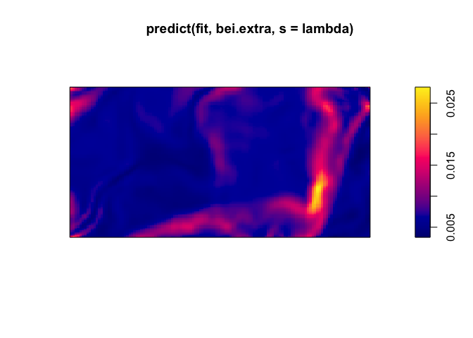
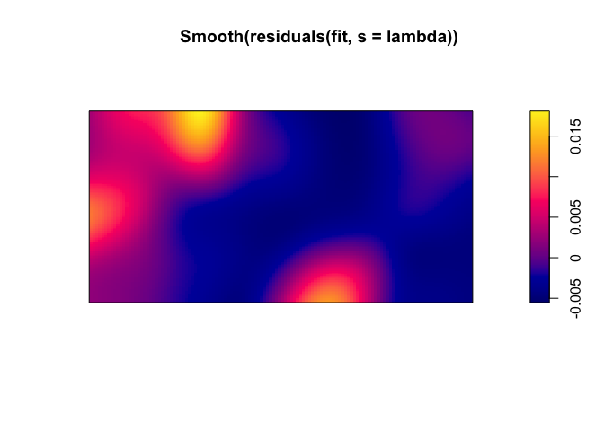

<!-- README.md is generated from README.Rmd. Please edit that file -->

# ppmnet

<!-- badges: start -->

<!-- badges: end -->

`ppmnet` is an R package for fitting regularized spatial point process
models.

Models are fit via penalized likelihood for Poisson point processes, and
via penalized composite likelihood for Gibbs point processes. The
model-fitting procedure is carried out by `glmnet`, which implements the
lasso and elastic net penalties. A number of methods are provided for
plotting, prediction, validation, and model selection on the basis of
(composite) information criteria.

This package closely conforms to the conventions of the `spatstat`
package, and relies heavily on `spatstat` classes and functions. As
such, use of `ppmnet` should be straightforward to those familiar with
`spatstat`.

## Installation

You can install `ppmnet` from [GitHub](https://github.com/) with:

``` r
devtools::install_github("jeffdaniel/ppmnet")
```

## Example

Fit a regularized inhomogeneous Poisson point process model to the `bei`
dataset included with `spatstat`.

``` r
fit <- ppmnet(quadscheme(bei), bei.extra)
```

Select the optimal model from the regularization path on the basis of
minimum AIC and plot the model’s predicted intensity surface.

``` r
lambda <- select(fit, "AIC")$lambda
#> Warning: minimum value of tuning parameter selected
plot(predict(fit, bei.extra, s = lambda))
```



Examine the smoothed residual field for the selected model.

``` r
plot(Smooth(residuals(fit, s = lambda)))
```



## Citation

Daniel, J., Horrocks, J., and Umphrey, G. J. Penalized composite
likelihoods for inhomogeneous Gibbs point process models. *Computational
Statistics and Data Analysis*, **124**, 104–116.
<https://doi.org/10.1016/j.csda.2018.02.005>
